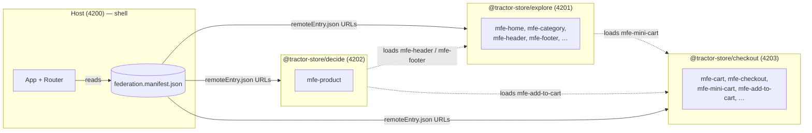

# Tractor Store — Documentation

The Tractor Store is a four-app micro-frontend (MFE) system: a thin
**host** shell plus three independently-deployed **remotes**, each
owned by a separate team. The host owns the URL and the page chrome;
the remotes ship UI as web components and link to each other through
_intent IDs_ instead of hard-coded URLs. All composition happens at
runtime — there is no build-time wiring between apps.

The runtime is [Native Federation v4][nf]. It is built on ECMAScript
Modules and Import Maps, so what we ship is plain browser-native code
with a small orchestration layer on top.

[nf]: https://native-federation.com/

## New to micro-frontends?

A micro-frontend architecture splits a single web application into
smaller apps that can be built, tested, and deployed independently.
Each team owns its slice end-to-end and the browser composes them at
runtime.

This project follows the [Tractor Store Blueprint][blueprint] — a
reference scenario for comparing MFE techniques across frameworks.
The teams are named for what they do in the customer journey
(**Explore**, **Decide**, **Checkout**), not for technical layers.
That vertical split is the canonical micro-frontends decomposition
described on [micro-frontends.org][mfo].

Three ideas carry the weight in this repo:

1. **Custom elements** (web components). Every UI fragment a remote
   exposes is registered as a `<mfe-*>` HTML tag. The host (or any
   other remote) places that tag in the DOM and the browser does the
   rest. The contract is plain HTML — no Angular import crosses team
   boundaries.
2. **A central event bus** (`window.__NF_REGISTRY__`). Remotes
   publish and subscribe to small, _typed_ channels instead of
   calling each other directly. Each channel is defined once with
   `defineChannel<Payload>(name)` in `@ng-internal/event-bus`;
   emitter and listener then share the same compile-time contract.
   Navigation, store selection, cart sync, and auth state all ride on
   this bus.
3. **Intent-based navigation.** A button in the _decide_ micro frontend that should
   open the cart never types `'/checkout/cart'`. It uses the
   `[appNavigateTo]` directive with the intent `'checkout.cart'`,
   and the host translates that to a URL. A team can rename its
   routes without touching anyone else's code.
4. **Host-owned authentication.** The shell owns the session,
   protects non-explore routes, redirects anonymous users to `/login`,
   and sends them back to the original URL after successful login.

Together these four keep the apps decoupled. The rest of this doc
set explains how each piece is implemented.

[blueprint]: https://github.com/neuland/tractor-store-blueprint
[mfo]: https://micro-frontends.org/

## At a glance

The manifest is the only static "wiring": every app fetches it at
startup and uses it to locate the others. The dotted lines are
_cross-remote fragment loads_ — a remote can mount another remote's
custom element inside its own page without going through the host.

## Read next

- **[Architecture](./architecture.md)** — what the host owns, what
  each remote owns, and the three decoupling mechanisms (custom
  elements, the event bus, intent-based navigation) plus how shared
  libraries are scoped.
- **[Authentication](./authentication.md)** — the host-owned auth
  contract, public vs protected routes, `/login`, and `returnUrl`.
- **[Navigation](./navigation.md)** — the intent-based navigation
  system and why it is the load-bearing piece of the host/remote
  decoupling.
- **[Features](./features.md)** — what each team ships, the
  fragments they expose, the events they emit, and the cross-remote
  dependencies between them.
- **[Docker & CI](./architecture.md#docker--containerisation)** —
  multi-stage Docker builds, local compose, and the branch-aware Azure
  Pipeline.

## Where does X live?

| Concern                                      | File / module                                                             |
| -------------------------------------------- | ------------------------------------------------------------------------- |
| Host bootstrap & federation init             | `projects/host/src/main.ts`                                               |
| Host DI providers & Router setup             | `projects/host/src/app/app.config.ts`                                     |
| App-initializer that wires the registry      | `projects/host/src/app/nav/provide-shell-nav.ts`                          |
| Building routes from contributions           | `projects/host/src/app/nav/setup-shell-nav.ts`, `remote-routes.ts`        |
| Loading a remote's custom element            | `libs/federation/src/lib/federation.ts` (`createSliceLoader`)             |
| Host route → element mount                   | `projects/host/src/app/loader/remote-shell.component.ts`                  |
| Cross-MFE link directive (`[appNavigateTo]`) | `libs/navigation/src/lib/navigate-to.directive.ts`                        |
| Intent → URL resolution                      | `projects/host/src/app/nav/nav-registry.ts`                               |
| Event-bus channel factory                    | `libs/event-bus/src/lib/event-bus-setup.ts` (`defineChannel`)             |
| Navigation channels                          | `libs/event-bus/src/lib/nav-event-bus.ts` (`nav:navigate`, `nav:intents`) |
| Auth channels                                | `libs/event-bus/src/lib/auth-event-bus.ts` (`auth:state`, `auth:login-request`, `auth:logout-request`) |
| Store-selected channel                       | `libs/event-bus/src/lib/store-event-bus.ts` (`store:selected`)            |
| Cross-instance cart sync                     | `projects/checkout/src/core/data/store/cart-bus.ts` (`cart:updated`)      |
| Host auth bootstrap + redirect flow          | `projects/host/src/app/auth/mock-auth.service.ts`, `auth.guard.ts`, `login.page.ts` |
| Path/query helpers (shared)                  | `libs/url/src/lib/path-template.ts`, `query.ts`, `route-params.ts`        |
| `NavPayload` / `RouteParams` types           | `libs/url/src/lib/nav-payload.ts`, `route-params.ts`                      |
| Remote bootstrap (custom-element)            | `projects/<remote>/src/features/<feature>/bootstrap.ts`                   |
| Per-remote shared injector                   | `projects/<remote>/src/core/shared-injector.ts`                           |
| Per-remote slice-loader token                | `projects/<remote>/src/core/remote-loader.ts` (`LOADER`)                  |
| Remote nav contribution                      | `projects/<remote>/src/core/nav-contribution.ts`                          |
| Federation config (per app)                  | `projects/<app>/federation.config.mjs`                                    |
| Runtime remote discovery                     | `projects/<app>/public/federation.manifest.json`                          |
| Per-environment values                       | `projects/<app>/public/env.config.json`                                   |
| Team boundary visualisation overlay          | `public/cdn/js/helper.js` |
| Multi-stage Dockerfiles per app              | `zarf/docker/Dockerfile.host`, `.explore`, `.decide`, `.checkout` |
| Docker Compose local dev                     | `zarf/docker/docker-compose.yml`                                      |
| Nginx config (SPA fallback, security headers)| `zarf/docker/nginx/default.conf`                                      |
| Docker runtime env-config injection          | `zarf/docker/docker-entrypoint.sh`                                    |
| Azure CI pipeline (branch-aware)             | `zarf/docker/azure-pipelines.yml`                                     |
| Docker-specific federation manifests         | `zarf/docker/manifests/`                                              |
| `.dockerignore`                              | `<repo-root>/.dockerignore` (Docker resolves this from build context) |
