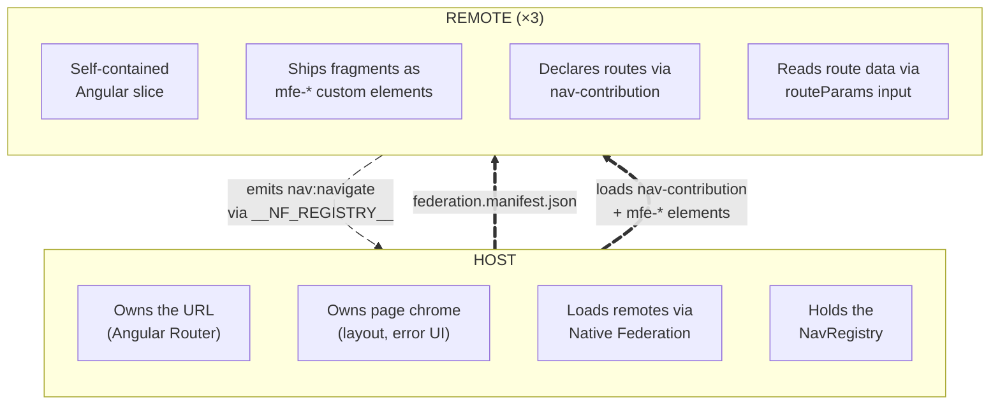
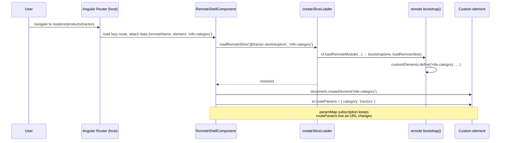
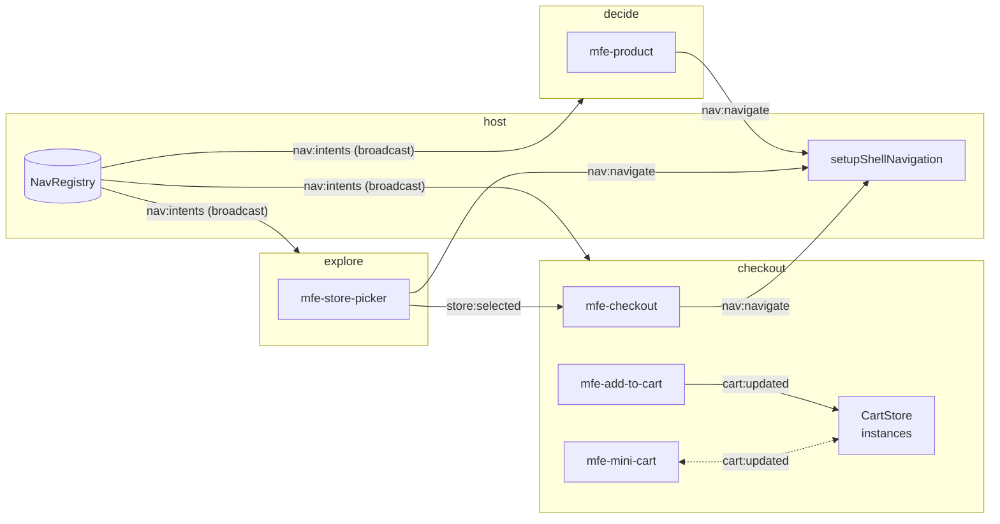
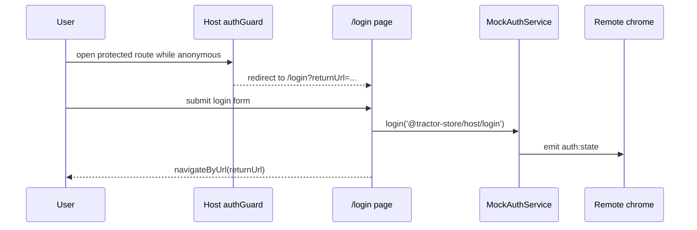
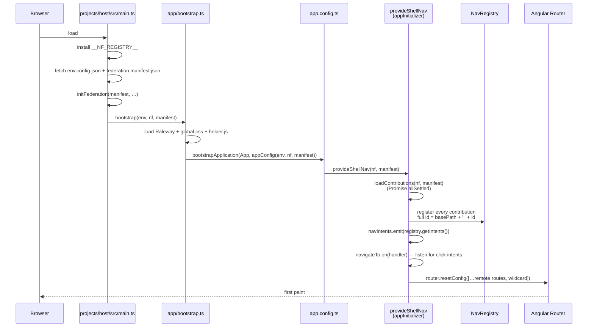

# Architecture

This document explains the contract between the host and the remotes —
what each side owns, where the boundary sits, and how the four runtime
mechanisms (custom elements, the event bus, intent-based navigation,
host-owned auth) make runtime composition possible without coupling the
apps together. A short note on shared libraries closes it out.

## Why decoupling matters

Three teams ship three Angular applications into one page. The
architecture has one job: keep those teams independent. _Independent_
means a team can rename a route, swap an internal component, or roll a
backend change forward without coordinating with the other teams.

Whenever two MFEs talk to each other directly — by importing types,
sharing a `Router`, or calling each other's services — they pick up a
hidden dependency that turns "deploy whenever you want" into "deploy
whenever the other team is ready". The architecture below avoids that
by inserting an explicit, stable contract at every place where the apps
meet.

> Michael Geers, _micro-frontends.org_: "_Isolate Team Code — Don't
> share a runtime, even if all teams use the same framework. Build
> independent apps that are self-contained._"

## The two-layer model

Two layers, with a small, explicit contract between them.



The contract has exactly four touchpoints:

1. **`federation.manifest.json`** — the host's list of remote names →
   entry URLs, fetched at startup.
2. **`nav-contribution`** — a module each remote _exposes_ that
   declares its base path and the intents (routable destinations) it
   owns.
3. **`mfe-*` custom elements** — the actual UI fragments, also exposed
   via federation. The host instantiates them with
   `document.createElement`.
4. **`routeParams`** — a single property the host writes onto a
   mounted custom element, carrying parsed path and query parameters.

Nothing else is shared at the boundary. There is no `import` from a
remote in host code, no Angular service crossing the line, no shared
router state.

## The three decoupling mechanisms

### 1. Custom elements as the integration surface

A remote does not ship Angular components for the host to import. It
ships **custom elements** (web components) registered under stable
`mfe-*` tags via `@angular/elements`.

A typical feature bootstrap
(`projects/explore/src/features/header/bootstrap.ts:9`):

```ts
const TAG = "mfe-header";

export async function bootstrap(env, loadRemoteSlice) {
  const injector = await ensureSharedInjector(env, loadRemoteSlice);
  if (!customElements.get(TAG)) {
    customElements.define(TAG, createCustomElement(HeaderComponent, { injector }));
  }
}
```

The browser's standard custom-element machinery does the integration.
Three consequences worth calling out:

- **Plain HTML is the contract.** A consumer drops `<mfe-cart>` in a
  template; nothing else is required. No Angular type, RxJS Observable,
  or service interface crosses the boundary.
- **One Angular per remote.** `ensureSharedInjector`
  (`projects/<remote>/src/core/shared-injector.ts`) lazily creates a
  single Angular `Injector` and reuses it for every feature in the same
  remote. When the host mounts `<mfe-home>` and `<mfe-header>` from
  explore, they share `HttpClient`, stores, and other DI-provided
  services — but nothing leaks across remotes.
- **Bootstrap is idempotent.** A `customElements.get(TAG)` guard inside
  each `bootstrap()` plus a matching check inside `createSliceLoader`
  (`libs/federation/src/lib/federation.ts:50`) make it safe to request
  the same fragment from many places. Only the first call defines the
  element; subsequent calls are no-ops.

> Cam Jackson, _martinfowler.com_: "_Each micro frontend is to define
> an HTML custom element for the container to instantiate, instead of
> defining a global function for the container to call._"

#### Loading a fragment: `LoadRemoteSlice`

Every app receives the same closure for loading remote fragments
(`libs/federation/src/lib/federation.ts:35`):

```ts
export type LoadRemoteSlice = (remoteName: string, exposedModule: string) => Promise<void>;

export const createSliceLoader = (env, nf, manifest): LoadRemoteSlice => {
  const loadRemoteSlice: LoadRemoteSlice = async (remoteName, exposedModule) => {
    if (customElements.get(exposedModule)) return; // already defined
    const mod = await nf.loadRemoteModule(remoteName, exposedModule);
    await mod.bootstrap(envForRemote(remoteName), loadRemoteSlice);
  };
  return loadRemoteSlice;
};
```

The host wires this closure into DI under `LOAD_REMOTE_SLICE`
(`projects/host/src/app/env.config.ts:6`); inside each remote the same
closure flows through as the `LOADER` token
(`projects/<remote>/src/core/remote-loader.ts`). A component that needs
to embed a foreign fragment simply asks for it and the closure takes
care of the federation module load, the bootstrap, and the
deduplication.

The loader passes _itself_ into the remote's bootstrap as the second
argument. That detail is how cross-remote loads work even when the
host is not in the picture: an explore feature mounting
`<mfe-mini-cart>` (from checkout) can call `loader('@tractor-store/checkout', 'mfe-mini-cart')`
and recursion gets it done.

#### Why a single `routeParams` property and not attributes

`HTMLElement` reserves a long list of property names (`id`, `slot`,
`title`, `hidden`, `style`, …). If the host wrote each route param as
its own attribute or property it would silently collide with
intrinsics — set `<mfe-cart id="abc">` and Angular would happily read
`''` because the DOM already owns `id`. Instead, all params land under
one well-known property (`routeParams`), and the remote reads them
through helpers in `libs/url/src/lib/route-params.ts` (`param`,
`requiredParam`, `paramList`). Clean separation, zero collisions.

#### How a route activation lands a custom element on the page



`RemoteShellComponent` (`projects/host/src/app/loader/remote-shell.component.ts`)
follows exactly this script: it reads `{ remoteName, element }` from
the route data, calls the loader, creates the element, and pipes
`paramMap` + `queryParamMap` into a single `routeParams` object. While
the slice is loading it shows a spinner; if the load fails it shows an
error message.

### 2. The event bus (`window.__NF_REGISTRY__`)

Custom elements solve composition: a remote can mount another remote's
UI. But composition alone is not enough — the remotes also need to
_talk_ to each other. They do that through a small, shared event bus
that the host sets up before Angular bootstraps.

The bus lives on `window.__NF_REGISTRY__` and is created at the top of
`projects/host/src/main.ts:18`:

```ts
window.__NF_REGISTRY__ = Object.freeze(
  createRegistry({
    maxStreams: 20,
    maxEvents: 1,
    removePercentage: 0.25,
  })(),
);
```

It is a pub/sub object provided by the Native Federation orchestrator
with two primitives, `emit(name, data)` and `on(name, handler)`. On
top of that primitive, `@ng-internal/event-bus` introduces a tiny
abstraction so that _channels_ carry both their name **and** their
payload type in one place
(`libs/event-bus/src/lib/event-bus-setup.ts:28`):

```ts
export interface ChannelHandle<TPayload> {
  readonly name: string;
  emit(payload: TPayload): void;
  on(handler: (payload: TPayload) => void): () => void;
}

export const defineChannel = <TPayload>(name: string): ChannelHandle<TPayload> => {
  requireBus(name);
  return Object.freeze({
    name,
    emit: (payload) => requireBus(name).emit<TPayload>(name, payload),
    on: (handler) => requireBus(name).on<TPayload>(name, (event) => handler(event.data)),
  });
};
```

Every cross-MFE channel is then declared in a one-line file:

```ts
// libs/event-bus/src/lib/nav-event-bus.ts
export const navigateTo = defineChannel<NavigatePayload>("nav:navigate");
export const navIntents = defineChannel<NavIntentMap>("nav:intents");

// libs/event-bus/src/lib/store-event-bus.ts
export const storeSelected = defineChannel<StoreSelectedPayload>("store:selected");
```

Both the emitter and the listener import the **same** channel handle,
so typos in the channel name and shape mismatches in the payload
become compile-time errors rather than silent runtime bugs.

> Cam Jackson, _martinfowler.com_: "_Custom events allow micro
> frontends to communicate indirectly, which is a good way to minimise
> direct coupling, though it does make it harder to determine and
> enforce the contract that exists between micro frontends._"

The typed channel handle is the answer to Jackson's caveat: each
channel's contract lives in one file that both ends import.

#### The channels in use today



| Channel          | Defined in                                          | Direction                  | Purpose                                                                                |
| ---------------- | --------------------------------------------------- | -------------------------- | -------------------------------------------------------------------------------------- |
| `nav:navigate`   | `libs/event-bus/src/lib/nav-event-bus.ts`           | remote → host              | Intent-based navigation requests (used by `[appNavigateTo]`)                           |
| `nav:intents`    | `libs/event-bus/src/lib/nav-event-bus.ts`           | host → remotes (broadcast) | Snapshot of `intentId → {basePath, path}` so directives can render real `href`s        |
| `auth:state`     | `libs/event-bus/src/lib/auth-event-bus.ts`          | host → remotes             | Current auth snapshot (`isAuthenticated`, `user`)                                      |
| `auth:login-request` | `libs/event-bus/src/lib/auth-event-bus.ts`      | remotes → host             | Request the host to simulate login                                                      |
| `auth:logout-request` | `libs/event-bus/src/lib/auth-event-bus.ts`     | remotes → host             | Request the host to simulate logout                                                     |
| `store:selected` | `libs/event-bus/src/lib/store-event-bus.ts`         | explore → checkout         | Notify checkout when the user picks a pickup store                                     |
| `cart:updated`   | `projects/checkout/src/core/data/store/cart-bus.ts` | checkout ↔ checkout        | Sync `CartStore` instances loaded from different slices, including across browser tabs |

The cart channel is worth a closer look. The **checkout** remote's
`CartStore` is an `@Injectable` service, so each slice that the loader
bootstraps gets its own instance. When `<mfe-mini-cart>` (mounted
inside explore's header) and `<mfe-cart>` (mounted as a host route)
run side by side, they would otherwise drift. The `cart-bus` rides on
the same `__NF_REGISTRY__` to keep both stores in step; it also
re-emits browser `storage` events so a second tab stays in sync
(`projects/checkout/src/core/data/store/cart-bus.ts:39`). The channel
is internal to checkout but uses the same `defineChannel` factory —
the cost of joining the bus is one line.

The pattern generalises: when two MFEs need to coordinate on a piece
of state, declare a channel via `defineChannel<Payload>('name')` and
import the same handle on both sides. No singleton service, no shared
DI tree, no hidden imports.

### 3. Host-owned authentication

Authentication follows the same boundary rule as navigation: the host
owns policy, remotes react to state.

The host owns:

- the single auth source of truth (`MockAuthService`)
- protected-route enforcement (`authGuard`)
- the `/login` route
- the `returnUrl` redirect-back flow

`MockAuthService.initialize()` publishes the current snapshot on
`auth:state` and subscribes to the login/logout request channels.
Remotes use those channels to ask the host to change auth state; they
do not mutate session state themselves.

In the current build only **explore** is public. `decide.product` and
all checkout routes are protected, so anonymous users land on the host
login page first and then return to the original URL after login.

## Auth flow sequence



### 4. Intent-based navigation

Custom elements compose UI. The event bus carries state. The
_navigation_ problem is bigger than either: every team wants to link
to pages owned by other teams, without hard-coding URLs that those
other teams may rename.

Each remote declares a `nav-contribution`
(`projects/<remote>/src/core/nav-contribution.ts`) listing its routable
intents:

```ts
// projects/checkout/src/core/nav-contribution.ts
export const navContribution: NavContribution = {
  source: "@tractor-store/checkout",
  basePath: "checkout",
  intents: [
    { id: "cart", path: "/cart", element: "mfe-cart" },
    { id: "checkout", path: "/checkout", element: "mfe-checkout" },
    { id: "thanks", path: "/thanks", element: "mfe-thanks" },
  ],
};
```

The remote owns relative intent IDs (`cart`, `checkout`, `thanks`).
The host prepends each contribution's `basePath` when it registers
them, producing the public IDs other teams link to (`checkout.cart`,
etc.). Remotes link by intent, never by URL — and a directive in
`@ng-internal/navigation` makes that ergonomic in templates. Full
walkthrough in [navigation.md](./navigation.md).

> Cam Jackson, _martinfowler.com_: "_Using the page URL for this
> purpose ticks many boxes … It's declarative, not imperative.
> I.e. 'this is where we are', rather than 'please do this thing'._"

The intent layer is what makes that declarative-URL model work
_without_ every team having to know every other team's URL scheme.

## The bootstrap chain

How a host page comes alive, end to end:



Two artefacts drive everything:

- **`env.config.json`** — per-environment values: `apiUrl`, `cdnUrl`,
  `production`, `scope`. Same shape across all four apps. CI rewrites
  it for the deployed environment, so the same build works locally
  and on GitHub Pages.
- **`federation.manifest.json`** — the discovery file:

  ```json
  {
    "@tractor-store/explore": "http://localhost:4201/remoteEntry.json",
    "@tractor-store/decide": "http://localhost:4202/remoteEntry.json",
    "@tractor-store/checkout": "http://localhost:4203/remoteEntry.json"
  }
  ```

  Each value is the URL of a remote's `remoteEntry.json` — the
  import-map fragment Native Federation publishes during build.
  `initFederation` merges all of them into the page's import map so
  any subsequent `nf.loadRemoteModule(remoteName, exposedModule)`
  resolves to the right bundle.

`__NF_REGISTRY__` is installed _before_ federation init, so remotes
that touch the bus during their own bootstrap (e.g. building channel
handles) always find it there.

## Native Federation vs. Module Federation

Native Federation is the standards-based alternative to webpack's
Module Federation. It implements the same mental model — remotes
publish a `remoteEntry`, the host imports modules from named remotes
at runtime — on top of ECMAScript Modules and Import Maps instead
of webpack runtime, so it works with esbuild/Vite/Rspack and aligns
with Angular 17+'s default builder.

> Manfred Steyer, _Announcing Native Federation 1.0_: "_Native
> Federation brings the proven mental model of webpack Module
> Federation to the browser — built on ESM and Import Maps,
> independent of any specific build tool._"

This workspace uses
[`@angular-architects/native-federation-v4`](https://www.npmjs.com/package/@angular-architects/native-federation-v4)
plus `@softarc/native-federation-orchestrator` (the runtime that
ships `createRegistry`, the event bus we attach to `__NF_REGISTRY__`).

## Shared libraries

Six TypeScript libraries live under `libs/`. Each has a single
responsibility; nothing in them holds business code.

| Package                   | Path               | Contains                                                                                                        | Shared at runtime? |
| ------------------------- | ------------------ | --------------------------------------------------------------------------------------------------------------- | ------------------ |
| `@ng-internal/event-bus`  | `libs/event-bus/`  | `defineChannel` factory, channel declarations (`navigateTo`, `navIntents`, `storeSelected`)                     | yes                |
| `@ng-internal/navigation` | `libs/navigation/` | `NavigateToDirective`, `NavContribution`/`NavIntent`/`NavTarget`/`NavBarContribution` types                     | yes                |
| `@ng-internal/url`        | `libs/url/`        | `RouteParams` helpers (`param`, `requiredParam`, `paramList`), path-template + query helpers, `NavPayload` type | yes                |
| `@ng-internal/ui`         | `libs/ui/`         | Design-system primitives (`Button`, `Spinner`)                                                                  | yes                |
| `@ng-internal/logging`    | `libs/logging/`    | `ConsoleLoggerService` for consistent log formatting                                                            | yes                |
| `@ng-internal/federation` | `libs/federation/` | `EnvironmentConfig`, `LoadRemoteSlice`, `createSliceLoader`, `toCdnUrl`                                         | no — bundled       |

Each app's `federation.config.mjs` lists the five shared libraries in
`sharedMappings`:

```ts
shared: {
  ...shareAll({ singleton: true, strictVersion: true, requiredVersion: 'auto', build: 'package' }, {
    overrides: {
      '@angular/core': { /* …same flags… */ includeSecondaries: { keepAll: true } },
    },
  }),
},
sharedMappings: [
  "@ng-internal/event-bus",
  "@ng-internal/navigation",
  "@ng-internal/url",
  "@ng-internal/ui",
  "@ng-internal/logging",
],
skip: ['rxjs/ajax', 'rxjs/fetch', 'rxjs/testing', 'rxjs/webSocket'],
```

What the flags mean:

- **`singleton: true` on Angular.** Exactly one `@angular/core` on the
  page. Without this, two copies of Angular would each have their own
  injector tree roots and DI would silently break across remotes.
  `strictVersion: true` makes a version mismatch fail loudly at load
  time instead of producing weird runtime bugs.
- **`includeSecondaries: { keepAll: true }` on `@angular/core`.** Keeps
  secondary entry points (`@angular/core/rxjs-interop`, etc.) in the
  shared bundle so remotes can use them without re-bundling them.
- **`sharedMappings`** for the internal libraries. These are TypeScript
  path-mapped libraries inside this workspace; sharing them means the
  host and all remotes use the same `NavigateToDirective`, the same
  `defineChannel` factory, the same `Spinner`. Critically, channel
  handles defined in `@ng-internal/event-bus` are _the same handles_
  in every app — one channel registration, one set of subscribers, no
  surprises.
- **`skip`** trims rxjs sub-entries that aren't used at runtime,
  cutting the shared bundle.

`@ng-internal/federation` is deliberately **not** shared. It is used
once at bootstrap inside each app's `main.ts`, so bundling it locally
avoids load-order puzzles: by the time anything tries to read it, the
slice loader has already been instantiated against the right
manifest.

> Cam Jackson, _martinfowler.com_: "_The most obvious candidates for
> sharing are 'dumb' visual primitives such as icons, labels, and
> buttons. … Be careful to ensure that your shared components contain
> only UI logic, and no business or domain logic. When domain logic
> is put into a shared library it creates a high degree of coupling
> across applications._"

Every shared lib in this workspace fits that rule: contracts (event
channels, type definitions), wiring (directive, slice loader), or
dumb UI primitives (button, spinner). No team's product logic ever
ends up in `libs/`.

## Team boundary visualisation

Each team has a colour:

| Team     | Hex       | Owns                      |
| -------- | --------- | ------------------------- |
| Explore  | `#FF5A54` | Catalog, header, footer   |
| Decide   | `#53FF90` | Product detail            |
| Checkout | `#FFDE54` | Cart, checkout, mini-cart |

The CDN ships a small overlay script (`public/cdn/js/helper.js`,
loaded by the host at bootstrap). It looks for `data-boundary` and
`data-boundary-page` attributes on rendered DOM and, when
`html.showBoundaries` is set, draws coloured boxes around each team's
contribution. It is a debugging aid for seeing at a glance which team
owns which pixel. The only _enforcement_ of team boundaries is the
federation config: a remote that wants something not in `shared` /
`sharedMappings` cannot accidentally import it from another remote.

## See also

- [Navigation](./navigation.md) — how the intent system makes the
  boundary navigable without coupling.
- [Features](./features.md) — concrete catalogue of what each remote
  ships and which events it speaks.
