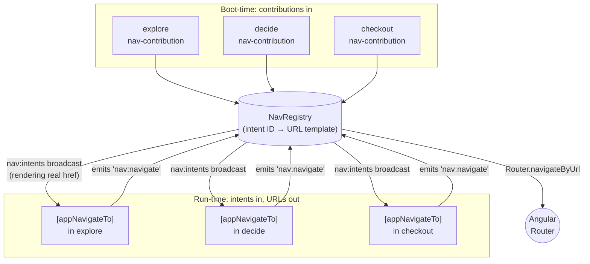
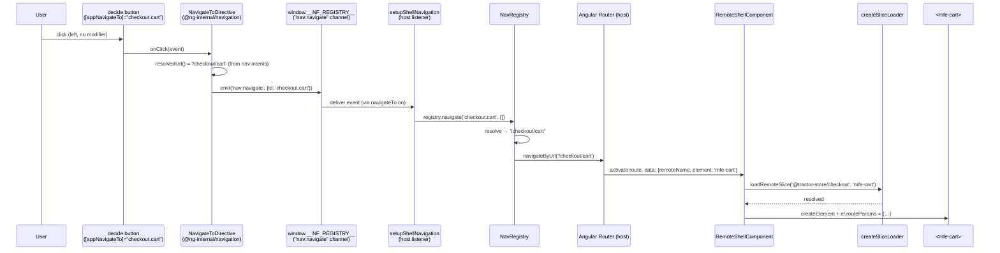

# Navigation

The Tractor Store has *one* router (in the host) and *zero* hard-coded
cross-team URLs in the remotes. A click in `decide` that should land
on the cart never mentions `/checkout/cart` — it emits the **intent**
`checkout.cart` and lets the host figure out the URL.

The host-owned routing layer also enforces auth. If a route is marked
protected and the user is anonymous, the host redirects to `/login` and
preserves the original URL in `returnUrl`.

This document walks through how that works, why the intent system is
the load-bearing piece of the host/remote decoupling, and how a click
in one remote becomes a route activation in another.

## The problem with the obvious solutions

In a naïve micro-frontend setup, remote A linking to remote B picks
one of two bad options:

- **Hard-code the URL.** Now A breaks every time B reorganises its
  routes, and renaming `/checkout` becomes a coordinated multi-team
  migration.
- **Import B's routing module.** Now A and B are build-time coupled,
  share a router instance, and can't deploy independently.

Both options leak B's URL scheme into A. The intent system removes
the leak entirely by letting each remote keep ownership of its URLs
while exposing a stable, public name (the intent) to the rest of the
world.

If you're familiar with Android's deep-link Intents, the model is the
same: the caller names *what* it wants to reach, the platform decides
*where* that lives.

## The contract: `nav-contribution`

Each remote *exposes* (via `federation.config.mjs`) a
`nav-contribution` module. It is a single object describing what the
remote routes (`projects/explore/src/core/nav-contribution.ts`):

```ts
export const navContribution: NavContribution = {
  source: '@tractor-store/explore',
  basePath: 'explore',
  intents: [
    { id: 'home',              path: '/',                    element: 'mfe-home' },
    { id: 'products',          path: '/products',            element: 'mfe-category' },
    { id: 'products.category', path: '/products/{category}', element: 'mfe-category' },
    { id: 'stores',            path: '/stores',              element: 'mfe-stores' },
  ],
};
```

The shape (`libs/navigation/src/lib/nav-types.ts`):

- `source` — the federation remote name.
- `basePath` — the URL prefix the host will mount the remote under
  (`/explore`, `/decide`, `/checkout`).
- `intents[]` — every routable destination the remote owns:
  - `id` — the public name *relative to the remote*. The host prepends
    `basePath` when it registers each intent, so `explore`'s
    `{ id: 'home' }` becomes the public `explore.home`. Other remotes
    link to the full ID, never to a URL.
  - `path` — the path *inside* `basePath`, with optional `{param}`
    segments (RFC 6570 URI Template syntax — the host's `toRoutePath`
    converts these to Angular's `:param` form when registering routes,
    so the contribution stays framework-neutral).
  - `element` — the `mfe-*` custom element to render at that path.
- `navBar?` — optional contributions to a shared nav bar (intent ID +
  label + order). The registry exposes a sorted list of them via
  `getNavBar()`; the current build does not render one, but the slot
  is there for teams that want to add menu items without coordinating.

The full intent ID is the only thing that crosses team boundaries.
URLs and element tags are an implementation detail of the owning
team.

## Boot-time wiring

When the host starts, it loads every remote's `nav-contribution` in
parallel and uses them to build its router config and a *registry* of
intents.

The orchestration
(`projects/host/src/app/nav/setup-shell-nav.ts:26`) is small enough to
read in full:

```ts
export const setupShellNavigation = async ({
  router,
  nf,
  manifest,
  onNavigate = (handler) => navigateTo.on(handler),
  fallbackRedirect = 'explore',
}): Promise<void> => {
  const loaded = await loadContributions(nf, manifest);

  const registry = new NavRegistry((url) => router.navigateByUrl(url));
  for (const { contribution } of loaded) registry.register(contribution);
  navIntents.emit(registry.getIntents());

  onNavigate(({ id, payload }) => {
    void registry.navigate(id, payload).catch((err) => {
      console.error(`[nav] navigation to intent "${id}" failed`, err);
    });
  });

  router.resetConfig([
    ...buildRemoteRoutes(loaded),
    { path: '**', redirectTo: fallbackRedirect },
  ]);
};
```

It does four things:

1. **Loads contributions.** `loadContributions` (`projects/host/src/app/nav/load-contributions.ts`)
   uses `Promise.allSettled` so a broken remote does not break the
   whole shell — it just disappears from the registry with a
   console warning.
2. **Builds the `NavRegistry`** and hands it a one-line navigator that
   calls `Router.navigateByUrl`. The registry holds no Angular
   dependency, so it is trivially unit-testable.
3. **Broadcasts the intent map on `nav:intents`.** The
   `NavigateToDirective` listens to this channel and uses the map to
   render real `href` attributes on anchor tags (so middle-click,
   "copy link", and screen-reader URL announcements work).
4. **Subscribes to `nav:navigate`** and listens for click intents.
   Every `[appNavigateTo]` click in any remote lands here, gets
   resolved by the registry, and finally hits the Router.
5. **Resets the Angular Router config** with the host login route,
   one route per intent that has an `element`, and the wildcard
   fallback. Every route lazy-loads the same `RemoteShellComponent`;
   only the route data differs (`projects/host/src/app/nav/remote-routes.ts:33`):

   ```ts
   routes.push({
     path: toRoutePath(contribution.basePath, intent.path),
     loadComponent: loadRemoteShell,
     canActivate: intent.requiresAuth ? [authGuard] : undefined,
     data: { remoteName, element: intent.element },
   });
   ```

The guard itself lives in the host and returns a `UrlTree` to
`/login?returnUrl=...` when the user is not authenticated.

The DI adapter `projects/host/src/app/nav/provide-shell-nav.ts` runs
this orchestration as an `appInitializer`, so by the time the user
sees the first frame the registry is populated and routing is wired.

## The registry as a hub



Contributions flow into the registry once, at startup. The registry
then broadcasts a snapshot back to the remotes so their directives can
render real anchors. After that, every click in every remote routes
through the single host-owned listener. The registry itself never
leaves the host — remotes only ever speak the public intent ID.

## Linking from a remote: `[appNavigateTo]`

Remotes never type a URL and never inject `Router`. They use a
directive shipped from `@ng-internal/navigation`:

```html
<a [appNavigateTo]="'checkout.cart'">Cart</a>

<button
  [appNavigateTo]="'decide.product'"
  [navPayload]="{ id: product.id }">
  See details
</button>
```

The directive
(`libs/navigation/src/lib/navigate-to.directive.ts`) does three
things on top of "emit on click":

```ts
@Directive({
  selector: '[appNavigateTo]',
  host: {
    '[attr.href]': 'hrefAttr()',
    '(click)': 'onClick($event)',
    '[style.cursor]': '"pointer"',
  },
})
export class NavigateToDirective {
  readonly appNavigateTo = input.required<string>();
  readonly navPayload = input<NavPayload>(EMPTY_PAYLOAD);

  // 1. Listens to nav:intents to know every remote's URL template.
  private readonly intents = signal<NavIntentMap>(EMPTY_MAP);

  // 2. Resolves the intent + payload to a real URL.
  private readonly resolvedUrl = computed<string | null>(() => { /* … */ });

  // 3. Binds the URL to [attr.href] on anchors so href-y features work.
  protected readonly hrefAttr = computed<string | null>(() =>
    this.isAnchor ? this.resolvedUrl() : null,
  );

  protected onClick(event: MouseEvent): void {
    if (this.isAnchor && /* modifier or middle-click */) return; // let the browser handle it
    if (this.resolvedUrl() === null) return;
    if (this.isAnchor) event.preventDefault();
    navigateChannel.emit({
      id: this.appNavigateTo(),
      payload: this.navPayload(),
    });
  }
}
```

That listener-side resolution is what makes anchors behave naturally.
A plain left-click is intercepted and converted into a `nav:navigate`
event (no full reload). A middle-click, `Ctrl+click`, or "Copy link
address" is *not* intercepted — the real `href` is on the element, so
the browser does the right thing.

A `[appNavigateTo]` to an unknown intent emits nothing (the directive
sees `resolvedUrl() === null` and skips). A subscriber-side mistake —
an unknown intent making it to the host — is logged by the registry:
`[nav] cannot navigate to unknown or unresolvable intent "…"`. A
half-deployed system fails *visibly in the console* rather than
silently in the URL bar.

## Reading params on the receiving end

Once the host's route activates, `RemoteShellComponent` mounts the
right custom element and writes a `routeParams` object onto it. The
remote component reads it through Angular's component-input binding:

```ts
// projects/decide/src/features/product/product.page.ts
readonly routeParams = input<RouteParams>({});

readonly id  = computed(() => param(this.routeParams(), 'id'));
readonly sku = computed(() => param(this.routeParams(), 'sku'));
```

`param`, `requiredParam`, `paramList`, and `sameRouteParams` are tiny
helpers from `libs/url/src/lib/route-params.ts`. They handle the
single-value-vs-array shape (multi-value query params come through as
arrays) and throw helpful errors for missing required params.

## End-to-end: a click in `decide` becomes a URL change



Notice what *isn't* in the diagram: no import from `decide` to
`checkout`, no shared `Router` instance, no string `'/checkout/cart'`
typed anywhere inside `decide`'s code. The only thing crossing the
boundary is the literal `'checkout.cart'`.

If that intent resolves to a protected route, the host intercepts it
before the remote mounts and routes to the login page first.

## Programmatic navigation: emit directly

`[appNavigateTo]` is for templates. From TypeScript, a remote
navigates by importing the same channel handle and emitting through
it:

```ts
// projects/checkout/src/features/checkout/checkout.page.ts
import { navigateTo } from '@ng-internal/event-bus';

onSubmit(event: Event): void {
  event.preventDefault();
  if (!this.isReady()) return;
  this.cart.clear();
  navigateTo.emit({ id: 'checkout.thanks' });
}
```

This is the same channel the directive uses, so any future
intent-related feature (param validation, deep-link auditing,
analytics) only needs to be added once at the host listener.

## Resolving params and query strings

Two kinds of parameters can travel with an intent:

- **Path params** — placeholders in the intent's `path`, e.g.
  `/product/{id}`. The registry fills them in from `navPayload`.
- **Query params** — anything in `navPayload` that wasn't consumed by
  a placeholder gets appended as a query string.

The split happens in `NavRegistry.resolve`
(`projects/host/src/app/nav/nav-registry.ts:89`):

```ts
const path = joinPath(intent.basePath, resolveTemplate(intent.path, payload));
const consumed = new Set(splitIntentParams(intent.path));
const queryParams: Record<string, string> = {};
for (const [key, value] of Object.entries(payload)) {
  if (!consumed.has(key)) queryParams[key] = value;
}
return appendQueryString(path, queryParams);
```

So an emit like

```ts
navigateTo.emit({
  id: 'decide.product',
  payload: { id: '123', sku: 'BLUE-XL' },
});
```

with the contribution `{ id: 'product', path: '/product/{id}', element: 'mfe-product' }`
resolves to `/decide/product/123?sku=BLUE-XL`. The remote then reads
`id` and `sku` off `routeParams` on its custom element.

`joinPath`, `resolveTemplate`, `splitIntentParams`, and
`appendQueryString` are the path-template helpers from
`@ng-internal/url`. They're shared because both the host (resolving)
and the directive (rendering anchors) need to apply the *same*
template logic.

## What this design buys you

Several payoffs fall out of the design:

- **Independent deploys.** A team can rename `/checkout/cart` to
  `/cart` by editing one path in their own `nav-contribution.ts`. No
  other remote needs to know — `checkout.cart` still resolves, just
  to a different URL.
- **No router import in remotes.** Remotes don't depend on
  `@angular/router` for navigation. The directive ships in a small
  shared library; the actual Router lives only in the host.
- **The host owns zero remote-specific knowledge.** It iterates over
  the contributions it loaded and builds routes generically — there
  is no `if (remoteName === 'checkout')` anywhere in the host code.
- **Testable in isolation.** Each remote runs standalone on its own
  port with the same `federation.manifest.json`. When `decide` boots
  on `:4202` it loads `mfe-header` from `:4201` (explore) and
  `mfe-add-to-cart` from `:4203` (checkout) just like the host would.
- **Standards-friendly.** All cross-app messaging goes through one
  tiny global (`window.__NF_REGISTRY__`). The bus is plain pub/sub;
  the only Angular-specific piece, `NavigateToDirective`, is ~80
  lines.

The intent system is what turns "three Angular apps loaded into one
page" into "three independently-evolving products that happen to
share a shell".

## See also

- [Architecture](./architecture.md) — the runtime and custom-element
  bridge that the navigation layer rides on top of.
- [Authentication](./authentication.md) — how protected routes,
  `/login`, and `returnUrl` fit into the host-owned router.
- [Features](./features.md) — the full list of intents per team.
